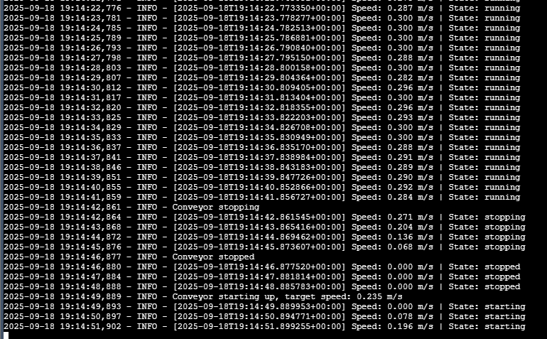
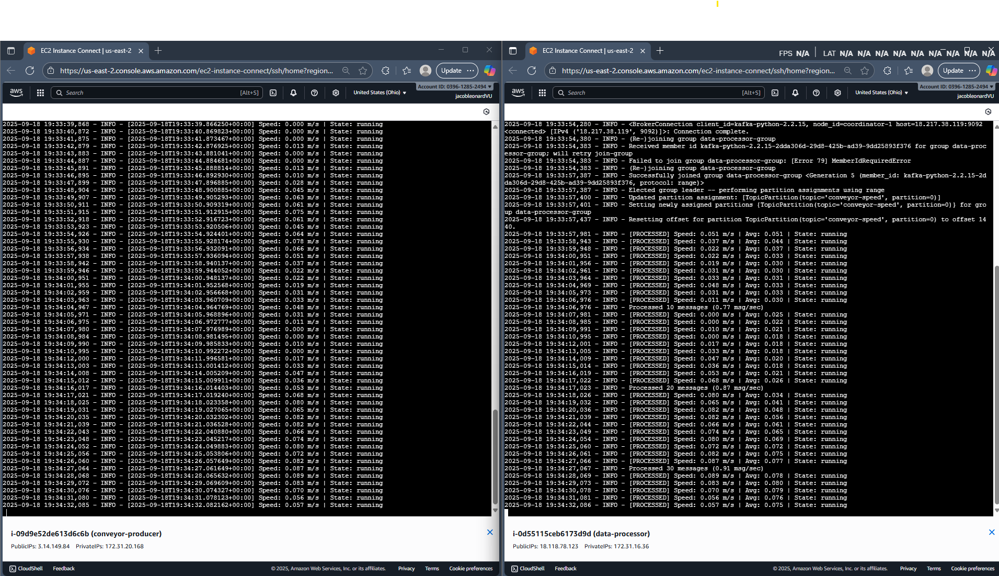
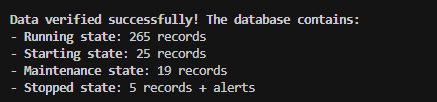
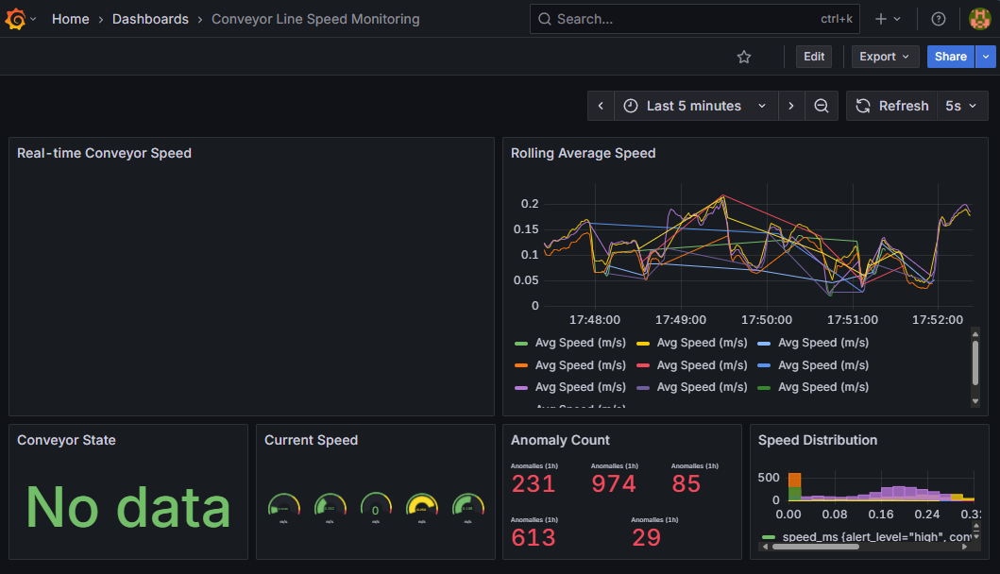
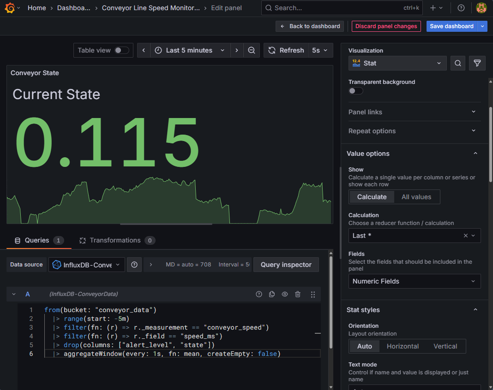

# CA0: Real-time Conveyor Speed Monitoring Pipeline

A complete real-time data pipeline monitoring conveyor line speeds (0.0-0.3 m/s) across 5 AWS t2.micro instances.

## Architecture

```
Producer → Kafka → Processor → InfluxDB → Grafana
```

- **Producer** (3.14.149.84): Generates realistic conveyor data
- **Kafka Hub** (18.217.38.119): Message streaming with KRaft mode
- **Processor** (18.118.78.123): Data transformation & analytics
- **InfluxDB** (18.224.136.43): Time-series data storage
- **Grafana** (18.217.68.206): Live visualization dashboard

## Features

- **Real-time data flow** at ~2.7 messages/second
- **5 conveyor states**: stopped, starting, running, stopping, maintenance
- **Rolling window analytics** with 10-message buffer
- **Anomaly detection** for speed limits and state changes
- **Live dashboard** with auto-refresh every 5 seconds

## Dashboard Access

Visit: http://18.217.68.206:3000

## Data Pipeline

1. **Data Generation**: Python script simulates conveyor behavior
2. **Stream Processing**: Kafka topic `conveyor-speed` handles message flow
3. **Data Transformation**: Processor enriches data with analytics
4. **Storage**: InfluxDB stores time-series data with tags and fields
5. **Visualization**: Grafana displays real-time speed, averages, and states

## Pipeline Progress Images

### Producer → Kafka Connection

Simulating conveyor speed data.

### Producer → Kafka → Processor Pipeline


### InfluxDB Database Integration


### Grafana Dashboard Issue & Resolution



## Milestone Summary

1. **AWS Account Connection**: Configured IAM user and AWS CLI credentials for us-east-2 region
2. **Producer Instance Creation**: Deployed Ubuntu 22.04 t2.micro instance with Python and kafka-python client
3. **Git Security Setup**: Implemented comprehensive .gitignore to protect AWS keys and SSH credentials
4. **OS Migration to Ubuntu**: Migrated from Amazon Linux 2 to Ubuntu 22.04 for better package management
5. **Conveyor Data Generator**: Created realistic conveyor speed simulation with JSON output and Kafka publishing
6. **Instance Optimization**: Reduced costs by switching kafka-hub from t2.medium to t2.micro
7. **Architecture Decision**: Finalized 5-instance pipeline with InfluxDB over Elasticsearch for time-series data
8. **Producer → Kafka → Processor**: Established working 3-stage pipeline with data transformation and analytics
9. **Complete 4-Stage Pipeline**: Added InfluxDB integration with time-series storage and health monitoring
10. **End-to-End with Grafana**: Deployed live dashboard with fixed query aggregation for continuous visualization

## Status: COMPLETE

All components operational with end-to-end data flow verified at ~2.7 messages/second.