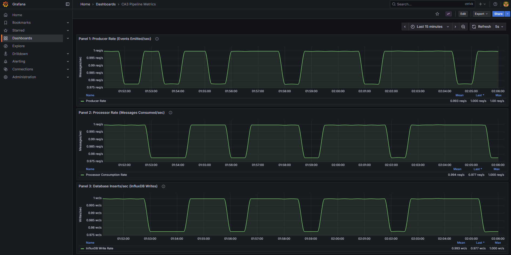
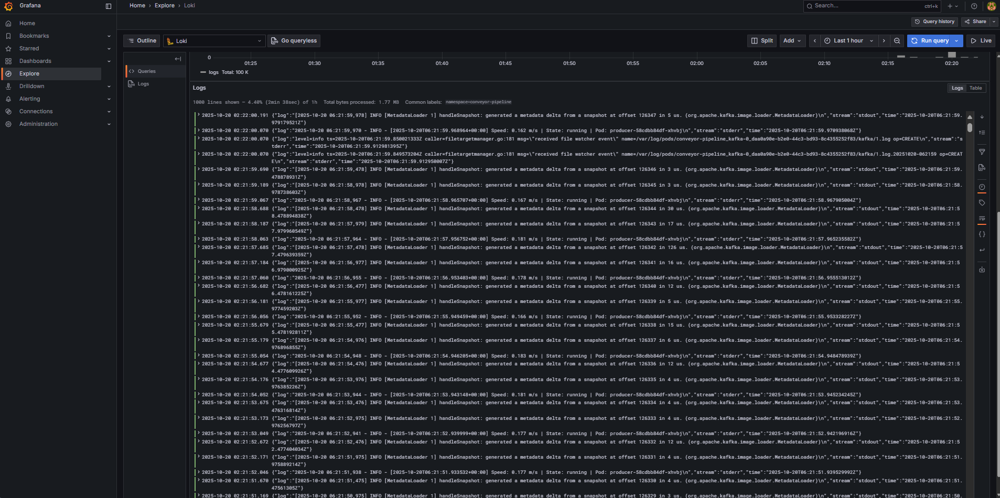

# CA3: Advanced Observability & Resilience

Extends CA2 with production-grade observability (Prometheus, Grafana, Loki), TLS encryption, and validated self-healing capabilities.

## Components

- **Producer**: Generates simulated conveyor speed data with Prometheus metrics
- **Kafka**: Message broker (KRaft mode, no ZooKeeper)
- **Processor**: Consumes from Kafka, performs analytics, writes to InfluxDB (HTTPS)
- **InfluxDB**: Time-series database with TLS encryption
- **Grafana**: Visualization dashboard with 3 datasources (InfluxDB, Prometheus, Loki)
- **Prometheus**: Metrics collection and querying
- **Loki**: Centralized log aggregation
- **Promtail**: Log collector DaemonSet

## Architecture

```
Producer (HPA 1-5) → Kafka → Processor → InfluxDB (HTTPS) → Grafana
  (Deployment)     (StatefulSet) (Deployment)  (StatefulSet)   (Deployment)
  Metrics: :8000    PVC 10Gi    Metrics: :8000   PVC 10Gi       NodePort
       ↓                              ↓              ↓
  Prometheus ←──────────────────────────────────────┘
  (Deployment)                                       ↓
       ↓                                        Loki (logs)
  Grafana Dashboards                           (Deployment)
                                                     ↑
                                               Promtail (DaemonSet)
                                              (scrapes pod logs)
```

## Key Features (CA3 Additions)

### Observability
- **Metrics**: Prometheus scraping producer/processor metrics
- **Dashboards**: Grafana with 3 Prometheus panels (producer rate, processor rate, InfluxDB writes)
- **Logging**: Loki + Promtail for centralized log search and filtering
- **Monitoring**: Real-time metrics and log correlation

### Security
- **TLS/HTTPS**: InfluxDB with self-signed certificates
- **Encrypted Connections**: All InfluxDB traffic over HTTPS
- **Secrets Management**: TLS certificates stored in Kubernetes Secrets
- **Network Policies**: Inherited from CA2 (6 policies)

### Resilience
- **Self-Healing**: Validated automatic recovery for all components
- **Load Testing**: HPA scaling tested under CPU stress
- **Failure Injection**: Automated resilience testing script
- **Operator Procedures**: Documented troubleshooting runbooks

## Prerequisites

- Kubernetes cluster (v1.25+) - Docker Desktop with Kubernetes enabled
- kubectl (v1.25+)
- Docker (for building images)
- metrics-server (for HPA) - deployed automatically by scripts

## Quick Start

### 1. Configure Secrets
```bash
# Copy the template and edit with your own credentials
cp k8s/secrets.yaml.template k8s/secrets.yaml

# Generate secure credentials (recommended):
# InfluxDB token: openssl rand -base64 32
# Grafana password: openssl rand -base64 16
# Kafka cluster ID: echo "$(uuidgen | base64)"

# Edit k8s/secrets.yaml and replace all REPLACE_WITH_* placeholders
```

**IMPORTANT**: Never commit `k8s/secrets.yaml` to version control. It's already in `.gitignore`.

### 2. Generate TLS Certificates (InfluxDB)
```bash
cd k8s/tls
bash generate-influxdb-certs.sh
cd ../..
```

This creates self-signed certificates for InfluxDB HTTPS connections.

### 3. Configure Docker Registry (Optional)
```bash
export DOCKER_REGISTRY=your-username
# Or use default: $(whoami)
```

### 4. Build Images
```bash
./scripts/build-images.sh
```

**CA3 Images:**
- `j14le/conveyor-producer:ca3-metrics` - Producer with Prometheus metrics
- `j14le/conveyor-processor:ca3-metrics-tls` - Processor with metrics and TLS support

### 5. Deploy
```bash
./scripts/deploy.sh
```

This deploys:
- Core pipeline (producer, kafka, processor, influxdb, grafana)
- Prometheus metrics server
- Loki + Promtail logging stack
- metrics-server for HPA
- TLS certificates for InfluxDB

### 6. Validate
```bash
./scripts/validate.sh
# Expected: 26/26 tests passed (inherited from CA2)
```

### 7. Access Services

**Grafana Dashboard:**
```bash
# URL displayed at end of deploy.sh
# Example: http://localhost:30715

# Login: admin / <password-from-secrets.yaml>
# Dashboards:
#   - "Conveyor Line Speed Monitoring" (InfluxDB data)
#   - "CA3 Pipeline Metrics" (Prometheus metrics with 3 panels)
```

**Prometheus UI:**
```bash
kubectl port-forward -n conveyor-pipeline svc/prometheus-service 9090:9090
# Access: http://localhost:9090
```

**Loki Logs (via Grafana Explore):**
- Open Grafana → Explore → Select "Loki" datasource
- Query: `{namespace="conveyor-pipeline"}`
- Filter: `{namespace="conveyor-pipeline"} |= "error"`

## Observability Setup

### Prometheus Metrics

**Custom Application Metrics:**
- `producer_messages_sent_total` - Total messages published to Kafka
- `producer_messages_sent_rate` - Messages per second
- `processor_messages_consumed_total` - Total messages consumed from Kafka
- `processor_messages_processed_success_total` - Successfully processed messages
- `processor_influxdb_writes_total` - Total writes to InfluxDB
- `processor_message_processing_duration_seconds` - Processing latency histogram
- `processor_anomalies_detected_total` - Anomaly detection counter
- `processor_current_speed_ms` - Current conveyor speed gauge

**Scrape Targets:**
- Producer pods: `:8000/metrics`
- Processor pods: `:8000/metrics`
- Prometheus itself: `:9090/metrics`

**Verify Metrics:**
```bash
# Check metrics endpoint
kubectl exec -n conveyor-pipeline -l app=producer -- curl localhost:8000/metrics

# Query in Prometheus UI
sum(rate(producer_messages_sent_total[1m]))
sum(rate(processor_messages_consumed_total[1m]))
sum(rate(processor_influxdb_writes_total[1m]))
```

### Grafana Dashboards

**CA3 Pipeline Metrics Dashboard:**
- **Panel 1**: Producer Rate (events emitted/sec) - `sum(rate(producer_messages_sent_total[1m]))`
- **Panel 2**: Processor Rate (messages consumed/sec) - `sum(rate(processor_messages_consumed_total[1m]))`
- **Panel 3**: Database Inserts/sec - `sum(rate(processor_influxdb_writes_total[1m]))`

**Datasources:**
- **InfluxDB-ConveyorData** (HTTPS): Time-series data from pipeline
- **Prometheus**: Metrics from producer/processor applications
- **Loki**: Centralized logs from all pods

### Centralized Logging (Loki)

**Components:**
- **Loki**: Log aggregation backend (port 3100)
- **Promtail**: DaemonSet that collects logs from all pods

**Log Queries:**
```bash
# All logs from namespace
{namespace="conveyor-pipeline"}

# Logs from specific app
{namespace="conveyor-pipeline", app="producer"}

# Search for errors
{namespace="conveyor-pipeline"} |= "error"

# Processor InfluxDB writes
{namespace="conveyor-pipeline", app="processor"} |= "InfluxDB write"
```

**Access Logs:**
1. Open Grafana → Explore
2. Select "Loki" datasource
3. Enter LogQL query
4. View logs with timestamps and labels

## TLS Configuration

### InfluxDB HTTPS

**Certificate Generation:**
```bash
cd k8s/tls
bash generate-influxdb-certs.sh
```

This creates:
- `influxdb-cert.pem` - Self-signed certificate
- `influxdb-key.pem` - Private key
- Kubernetes Secret: `influxdb-tls`

**Configuration:**
- InfluxDB StatefulSet mounts certificates from secret
- Environment variables: `INFLUXD_TLS_CERT`, `INFLUXD_TLS_KEY`
- InfluxDB URL: `https://influxdb-service:8086`

**Client Configuration:**
- Processor: `verify_ssl=False` (accepts self-signed cert)
- Grafana: `tlsSkipVerify: true` in datasource config

**Verification:**
```bash
# Check InfluxDB health over HTTPS
kubectl exec -n conveyor-pipeline influxdb-0 -- curl -k https://localhost:8086/health

# Check processor logs (should show successful HTTPS writes)
kubectl logs -n conveyor-pipeline -l app=processor | grep "InfluxDB write"
```

**Security Note:** Self-signed certificates are acceptable for development. For production, use certificates from a trusted CA (Let's Encrypt, corporate PKI).

## Load Testing & HPA Validation

### Run Load Test
```bash
cd CA3
bash scripts/load-test.sh 120  # 120 second test
```

**Expected Behavior:**
1. CPU usage increases on producer pod
2. HPA detects CPU > 70% threshold
3. HPA scales producer from 1 → 2 replicas
4. CPU distributes across replicas
5. After test, HPA scales back down to 1 replica

**View Scaling:**
```bash
kubectl get hpa -n conveyor-pipeline --watch
kubectl get pods -n conveyor-pipeline --watch
```

**Metrics to Monitor:**
- HPA: `kubectl describe hpa producer-hpa -n conveyor-pipeline`
- CPU: `kubectl top pods -n conveyor-pipeline`
- Grafana: Check producer rate panel for throughput changes

### Heavy Load Test (1→5 Replicas)
```bash
bash scripts/heavy-load-test.sh 300  # 5 minute test
```

Demonstrates CPU distribution across multiple replicas.

## Resilience Testing

### Automated Failure Injection
```bash
cd CA3
bash scripts/resilience-test.sh
```

**Tests Performed:**
1. **Producer Pod Failure**: Deletes producer pod, validates Deployment recreates it
2. **Processor Pod Failure**: Deletes processor pod, validates automatic recovery
3. **Kafka StatefulSet Recovery**: Deletes Kafka pod, validates StatefulSet recreates with same identity

**Expected Results:**
- All pods recover within 30-40 seconds
- No manual intervention required
- Data pipeline resumes normal operation
- No message loss (Kafka buffering + consumer offsets)

**Recovery Times:**
- Producer: ~33 seconds
- Processor: ~36 seconds
- Kafka: ~32 seconds

### Manual Failure Testing

**Delete Producer Pod:**
```bash
kubectl delete pod -n conveyor-pipeline -l app=producer
kubectl get pods -n conveyor-pipeline --watch
```

**Delete Processor Pod:**
```bash
kubectl delete pod -n conveyor-pipeline -l app=processor
kubectl get pods -n conveyor-pipeline --watch
```

**Delete Kafka Pod:**
```bash
kubectl delete pod kafka-0 -n conveyor-pipeline
kubectl get pods -n conveyor-pipeline --watch
```

### Operator Procedures

Detailed troubleshooting and response procedures are documented in:
- `outputs/operator-procedures.md` - Complete runbook for common failures
- `outputs/resilience-test-summary.md` - Test results and analysis

## Validation Results

```
Total Tests: 26/26 PASSED
Success Rate: 100%

Pipeline Status:
✓ Producer → Kafka: Messages flowing
✓ Kafka → Processor: Consuming successfully
✓ Processor → InfluxDB: HTTPS writes confirmed
✓ InfluxDB → Grafana: Datasource connected (HTTPS)
✓ Prometheus: Scraping 3 targets (producer, processor, prometheus)
✓ Loki: Collecting logs from 8 pods
✓ Scaling: HPA tested 1→2→1 replicas
✓ Resilience: All components self-heal in <40s
✓ Security: 6 NetworkPolicies, TLS enabled
```

## Useful Commands

### General
```bash
# View all resources
kubectl get all -n conveyor-pipeline

# Check pod status
kubectl get pods -n conveyor-pipeline -o wide

# View HPA status
kubectl get hpa -n conveyor-pipeline

# Check resource usage
kubectl top pods -n conveyor-pipeline
```

### Logs
```bash
# Producer logs
kubectl logs -f -l app=producer -n conveyor-pipeline

# Processor logs (shows InfluxDB HTTPS writes)
kubectl logs -f -l app=processor -n conveyor-pipeline

# Kafka logs
kubectl logs -f kafka-0 -n conveyor-pipeline

# InfluxDB logs
kubectl logs -f influxdb-0 -n conveyor-pipeline

# Prometheus logs
kubectl logs -f -l app=prometheus -n conveyor-pipeline

# Loki logs
kubectl logs -f -l app=loki -n conveyor-pipeline

# Promtail logs
kubectl logs -f -l app=promtail -n conveyor-pipeline
```

### Port Forwarding
```bash
# Grafana
kubectl port-forward -n conveyor-pipeline svc/grafana-service 3000:3000

# Prometheus
kubectl port-forward -n conveyor-pipeline svc/prometheus-service 9090:9090

# InfluxDB (HTTPS)
kubectl port-forward -n conveyor-pipeline svc/influxdb-service 8086:8086

# Loki
kubectl port-forward -n conveyor-pipeline svc/loki-service 3100:3100
```

### Scaling
```bash
# Manual scale
kubectl scale deployment producer --replicas=3 -n conveyor-pipeline

# View HPA events
kubectl describe hpa producer-hpa -n conveyor-pipeline

# Watch scaling in real-time
kubectl get hpa -n conveyor-pipeline --watch
```

### Metrics & Monitoring
```bash
# Check Prometheus targets
kubectl port-forward -n conveyor-pipeline svc/prometheus-service 9090:9090
# Open: http://localhost:9090/targets

# Query metrics directly
kubectl exec -n conveyor-pipeline -l app=producer -- curl localhost:8000/metrics

# Test InfluxDB HTTPS
kubectl exec -n conveyor-pipeline influxdb-0 -- curl -k https://localhost:8086/health
```

### Troubleshooting
```bash
# Describe pod for events
kubectl describe pod <pod-name> -n conveyor-pipeline

# View recent events
kubectl get events -n conveyor-pipeline --sort-by='.lastTimestamp'

# Check network policies
kubectl get networkpolicies -n conveyor-pipeline

# Verify secrets
kubectl get secrets -n conveyor-pipeline

# Check TLS certificate
kubectl get secret influxdb-tls -n conveyor-pipeline -o yaml
```

### Cleanup
```bash
./scripts/destroy.sh
```

## Directory Structure

```
CA3/
├── k8s/                         # Kubernetes manifests
│   ├── namespace.yaml
│   ├── rbac.yaml
│   ├── secrets.yaml.template    # Template for secrets
│   ├── kafka/
│   ├── influxdb/                # ✨ Updated with TLS config
│   ├── processor/               # ✨ Updated with HTTPS + metrics
│   ├── producer/                # ✨ Updated with metrics
│   ├── grafana/                 # ✨ Enhanced with 3 datasources
│   ├── prometheus/              # ✨ NEW: Metrics collection
│   ├── logging/                 # ✨ NEW: Loki + Promtail
│   ├── tls/                     # ✨ NEW: TLS certificates
│   └── network/
├── docker/                      # Container images
│   ├── producer/                # ✨ Updated with Prometheus client
│   └── processor/               # ✨ Updated with Prometheus + TLS
├── scripts/                     # Automation
│   ├── build-images.sh
│   ├── deploy.sh                # ✨ Updated for CA3 components
│   ├── validate.sh
│   ├── destroy.sh
│   ├── load-test.sh             # ✨ NEW: HPA load testing
│   ├── heavy-load-test.sh       # ✨ NEW: Multi-replica testing
│   └── resilience-test.sh       # ✨ NEW: Failure injection
├── outputs/                     # Deliverables
│   ├── scaling-test-results.md  # HPA scaling evidence
│   ├── network-policies.yaml
│   ├── grafana-dashboard.png    # ✨ NEW: 3 Prometheus panels
│   ├── log-search.png           # ✨ NEW: Loki log filtering
│   ├── hpa-scaling.png          # ✨ NEW: Autoscaling events
│   ├── tls-config-summary.md    # ✨ NEW: TLS setup docs
│   ├── operator-procedures.md   # ✨ NEW: Troubleshooting runbook
│   ├── resilience-test-summary.md  # ✨ NEW: Failure testing results
│   └── pod-recovery-status.txt  # ✨ NEW: Recovery evidence
└── run_logs/                    # Validation audit trail

✨ = New or updated for CA3
```

## Outputs & Deliverables

All deliverables are provided in the `outputs/` directory:

### Observability
- **grafana-dashboard.png**: Screenshot of "CA3 Pipeline Metrics" with 3 Prometheus panels
- **log-search.png**: Loki log search filtered by "error" keyword across components

**Grafana Dashboard - 3 Prometheus Metrics:**



**Loki Centralized Log Search:**



### Scaling & Performance
- **scaling-test-results.md**: HPA scaling test (1→2→1 replicas) with CPU metrics
- **hpa-scaling.png**: Screenshot of HPA scaling events
- **hpa-scaling-events.txt**: `kubectl get hpa` output during load test

### Security
- **tls-config-summary.md**: Complete TLS implementation documentation
- **network-policies.yaml**: 6 NetworkPolicies (inherited from CA2)

### Resilience
- **resilience-test-summary.md**: Failure injection test results and analysis
- **operator-procedures.md**: Comprehensive troubleshooting runbook
- **pod-recovery-status.txt**: Pod status after automated recovery
- **resilience-drill.mp4**: Video demonstration (user to record)

## Key Improvements from CA2

| Feature | CA2 | CA3 |
|---------|-----|-----|
| Metrics Collection | None | Prometheus with custom app metrics |
| Dashboards | Basic InfluxDB panel | 3 Prometheus panels + enhanced InfluxDB |
| Logging | Per-pod logs only | Centralized Loki aggregation + search |
| Security | Network Policies | + TLS/HTTPS for InfluxDB |
| Monitoring | Manual kubectl logs | Real-time metrics + log correlation |
| Resilience | Assumed | Validated with automated tests |
| Documentation | Basic | + Operator procedures + runbooks |

## CA3 vs CA2 Architecture

**CA2 (Basic Kubernetes):**
- Pods communicate over plain HTTP
- Logs scattered across pods
- No application metrics
- Manual monitoring

**CA3 (Production-Grade):**
- InfluxDB uses HTTPS with TLS certificates
- Centralized logging with Loki
- Prometheus metrics from all apps
- Grafana dashboards for metrics + logs
- Validated self-healing
- Operator runbooks

## Pod Failure & Recovery Demonstration


**Kubernetes Self-Healing Validation**: Demonstrates automated pod recovery with zero manual intervention. Three critical components (Producer, Processor, Kafka) are individually deleted to simulate failures. Kubernetes Deployment and StatefulSet controllers automatically recreate all pods within 35-37 seconds. Data pipeline continues operating throughout with Kafka buffering preventing message loss. See [pod-recovery-demo-auto.sh](scripts/pod-recovery-demo-auto.sh) for the automated test script and generated reports for detailed recovery metrics.

## Known Issues

### Self-Signed Certificate Warnings
- **Symptom**: Processor logs show `InsecureRequestWarning`
- **Impact**: Cosmetic only, does not affect functionality
- **Resolution**: Expected for self-signed certificates; use CA-signed cert in production

### Kafka Consumer Rebalancing
- **Symptom**: "Re-joining group" messages after processor restart
- **Impact**: 5-10 second delay before consuming resumes
- **Resolution**: Normal Kafka behavior, no action needed

### Metrics Server on Docker Desktop
- **Symptom**: HPA shows `<unknown>` for CPU metrics
- **Resolution**: Run `kubectl apply -f https://github.com/kubernetes-sigs/metrics-server/releases/latest/download/components.yaml` and patch with `--kubelet-insecure-tls`
- **Note**: Deploy script handles this automatically

## Milestone Completion Status

- [x] **M1**: Foundation Setup (CA2 → CA3 migration)
- [x] **M2**: Prometheus Deployment
- [x] **M3**: Application Metrics Instrumentation
- [x] **M4**: Enhanced Grafana Dashboards (3 Prometheus panels)
- [x] **M5**: Centralized Logging (Loki + Promtail)
- [x] **M6**: Load Testing & HPA Validation
- [x] **M7**: TLS for InfluxDB
- [ ] **M8**: TLS for Kafka (Optional - Skipped)
- [x] **M9**: Resilience Testing (Failure injection + self-healing validation)
- [ ] **M10**: Documentation & Outputs (In Progress)
- [ ] **M11**: GitHub Submission

## Testing & Validation

### Full Deployment Test
```bash
# Clean deployment from scratch
./scripts/destroy.sh
./scripts/deploy.sh
./scripts/validate.sh
```

### Observability Validation
```bash
# 1. Check Prometheus targets
kubectl port-forward -n conveyor-pipeline svc/prometheus-service 9090:9090
# Open http://localhost:9090/targets (expect 3 healthy targets)

# 2. View Grafana dashboards
kubectl get svc grafana-service -n conveyor-pipeline
# Open NodePort URL, login, check both dashboards

# 3. Query Loki logs
# Grafana → Explore → Loki → Query: {namespace="conveyor-pipeline"}
```

### Resilience Validation
```bash
# Run automated resilience test
bash scripts/resilience-test.sh

# Verify all pods recovered
kubectl get pods -n conveyor-pipeline
```

### Load Testing Validation
```bash
# Run load test
bash scripts/load-test.sh 120

# Monitor HPA
kubectl get hpa -n conveyor-pipeline --watch

# Verify scaling occurred
kubectl describe hpa producer-hpa -n conveyor-pipeline | grep "New size"
```

## Troubleshooting

See `outputs/operator-procedures.md` for detailed troubleshooting procedures covering:
- Pod failures and recovery
- Network connectivity issues
- TLS/certificate problems
- HPA scaling issues
- Resource constraints
- Log analysis with Loki

## Future Work (CA4)

Potential enhancements for next iteration:
- Multi-AZ deployment for high availability
- Production-grade TLS with cert-manager + Let's Encrypt
- Prometheus AlertManager for proactive alerting
- Kafka TLS encryption (currently optional)
- Multi-tenant isolation
- GitOps with ArgoCD/Flux

## References

- [Prometheus Documentation](https://prometheus.io/docs/)
- [Grafana Documentation](https://grafana.com/docs/)
- [Loki Documentation](https://grafana.com/docs/loki/)
- [Kubernetes HPA](https://kubernetes.io/docs/tasks/run-application/horizontal-pod-autoscale/)
- [InfluxDB TLS Configuration](https://docs.influxdata.com/influxdb/v2.7/admin/security/enable-tls/)
