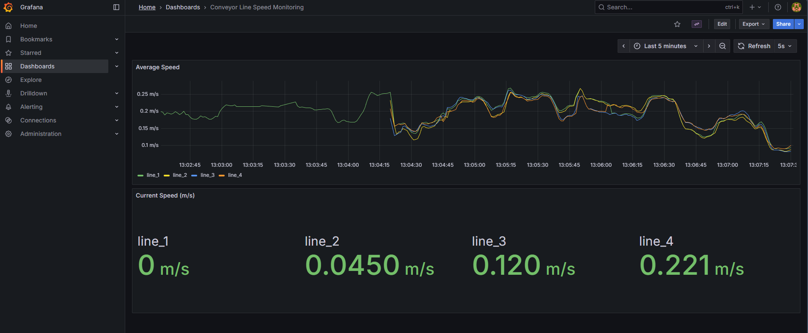

# CA4: Multi-Hybrid Cloud Deployment



Extends CA3 with multi-site cloud deployment across Edge (local Kubernetes) and Cloud (AWS), with secure connectivity and validated failure recovery.

## Topology: Edge → Cloud with SSH Tunnels

**Architecture:**
- **Edge Site (Local)**: Producer pods running on local Kubernetes (Docker Desktop)
- **Cloud Site (AWS)**: Kafka, Processor, InfluxDB, Grafana running on t3.small EC2 instance
- **Connectivity**: SSH tunnels for secure port forwarding between sites

## Components

### Edge Site (Local Kubernetes)
- **Producer**: Generates simulated conveyor speed data with Prometheus metrics
  - Deployment with HPA (1-5 replicas)
  - Metrics endpoint: `:8000/metrics`
  - Connects to Kafka via SSH tunnel (localhost:9092 → AWS:9092)

### Cloud Site (AWS EC2 t3.small)
- **Kafka**: Message broker (KRaft mode, no ZooKeeper)
  - Docker container with 384MB memory limit
  - Port: 9092
- **Processor**: Consumes from Kafka, writes to InfluxDB
  - Docker container with 256MB memory limit
  - Metrics endpoint: `:8000/metrics`
- **InfluxDB**: Time-series database with TLS encryption
  - Docker container with 256MB memory limit
  - HTTPS endpoint: `https://influxdb:8086`
- **Grafana**: Visualization dashboards
  - Docker container with 256MB memory limit
  - Web UI: `http://<aws-ip>:3000`

## Architecture Diagram

```
┌─────────────────────────────────────┐
│   EDGE SITE (Local Kubernetes)     │
│                                     │
│  ┌──────────────────────────────┐  │
│  │  Producer Pods (HPA 1-5)     │  │
│  │  - Docker Desktop K8s        │  │
│  │  - Namespace: conveyor-      │  │
│  │    pipeline-edge             │  │
│  │  - Metrics: :8000            │  │
│  └──────────────────────────────┘  │
│              │                      │
│              │ Kafka Messages       │
│              ↓                      │
│     SSH Tunnel (localhost:9092)    │
└─────────────────────────────────────┘
              │
              │ Internet
              │ SSH Port Forward
              ↓
┌─────────────────────────────────────┐
│ CLOUD SITE (AWS us-east-2)         │
│ EC2 Instance: t3.small              │
│ IP: 3.148.242.194                   │
│                                     │
│  ┌──────────────────────────────┐  │
│  │  Kafka (KRaft)               │  │
│  │  - Port: 9092                │  │
│  │  - Memory: 384MB             │  │
│  └──────────────────────────────┘  │
│              │                      │
│              ↓                      │
│  ┌──────────────────────────────┐  │
│  │  Processor                   │  │
│  │  - Kafka Consumer            │  │
│  │  - InfluxDB Writer (HTTPS)   │  │
│  │  - Memory: 256MB             │  │
│  └──────────────────────────────┘  │
│              │                      │
│              ↓                      │
│  ┌──────────────────────────────┐  │
│  │  InfluxDB (TLS)              │  │
│  │  - HTTPS: 8086               │  │
│  │  - Memory: 256MB             │  │
│  │  - Self-signed cert          │  │
│  └──────────────────────────────┘  │
│              │                      │
│              ↓                      │
│  ┌──────────────────────────────┐  │
│  │  Grafana                     │  │
│  │  - HTTP: 3000                │  │
│  │  - Memory: 256MB             │  │
│  │  - Dashboard provisioned     │  │
│  └──────────────────────────────┘  │
└─────────────────────────────────────┘

Security Groups:
- Port 22: SSH access (0.0.0.0/0)
- Port 3000: Grafana HTTP (0.0.0.0/0)
- Internal: Kafka, InfluxDB, Processor communicate within Docker network
```

## Secure Connectivity: SSH Tunnels

**Method**: SSH port forwarding from local machine to AWS EC2 instance

**Port Mappings:**
```
localhost:9092  → AWS:9092  (Kafka)
localhost:8086  → AWS:8086  (InfluxDB HTTPS)
localhost:3000  → AWS:3000  (Grafana)
localhost:8001  → AWS:8000  (Processor Metrics)
```

**SSH Command:**
```bash
ssh -i ~/.ssh/ca4-key \
    -L 9092:localhost:9092 \
    -L 8086:localhost:8086 \
    -L 3000:localhost:3000 \
    -L 8001:localhost:8000 \
    -N ubuntu@3.148.242.194
```

**Verification:**
```bash
# Test Kafka connectivity
nc -zv localhost 9092

# Test InfluxDB HTTPS
curl -k -I https://localhost:8086/health

# Test Grafana
curl -I http://localhost:3000
```

## Prerequisites

### Edge Site
- Docker Desktop with Kubernetes enabled
- kubectl (v1.25+)
- Docker (for building images)

### Cloud Site
- AWS Account with credentials configured
- Terraform (for infrastructure provisioning)
- SSH key pair (~/.ssh/ca4-key)

### Tools
- aws CLI
- terraform
- ssh client

## Security & Credentials Setup

**⚠️ IMPORTANT**: This repository uses template files for secrets. You MUST configure your own credentials before deployment.

### Step 1: Create Environment File

```bash
# Copy the template
cp .env.cloud.template .env.cloud

# Generate secure credentials
INFLUXDB_PASSWORD=$(openssl rand -base64 16)
INFLUXDB_TOKEN=$(openssl rand -base64 32)
GRAFANA_PASSWORD=$(openssl rand -base64 16)

# Edit .env.cloud and replace placeholders with generated values
nano .env.cloud
```

### Step 2: Configure Kubernetes Secrets

The `k8s/secrets.yaml` file already has placeholder values (`REPLACE_WITH_*`). These work for demo purposes, but for production:

```bash
# Generate secure values
API_KEY=$(openssl rand -base64 32)

# Edit k8s/secrets.yaml and replace REPLACE_WITH_SECURE_API_KEY
nano k8s/secrets.yaml
```

### Step 3: Generate SSH Keys

```bash
# Generate SSH key pair for AWS access
ssh-keygen -t rsa -b 4096 -f ~/.ssh/ca4-key -C "ca4-deployment"

# Set proper permissions
chmod 600 ~/.ssh/ca4-key
chmod 644 ~/.ssh/ca4-key.pub
```

### Step 4: Generate TLS Certificates

```bash
cd tls-certs/

# Generate self-signed certificate for InfluxDB
openssl genrsa -out influxdb-key.pem 2048
openssl req -new -key influxdb-key.pem -out influxdb-csr.pem \
  -subj "/C=US/ST=Tennessee/L=Nashville/O=YourOrg/CN=influxdb"
openssl x509 -req -days 365 -in influxdb-csr.pem \
  -signkey influxdb-key.pem -out influxdb-cert.pem

cd ..
```

### What's Protected by .gitignore

These files are **NEVER** committed to git:
- `.env.cloud` - Actual environment variables with secrets
- `*.pem`, `*.key` - SSH keys and TLS certificates
- `k8s/secrets.yaml` - Kubernetes secrets (has placeholders in repo)
- `terraform/*.tfstate` - Terraform state files
- `~/.ssh/ca4-key*` - SSH private/public keys

### What's Safe to Commit

These **template files** are safe and included in the repository:
- `.env.cloud.template` - Template with `REPLACE_WITH_*` placeholders
- `k8s/secrets.yaml.template` - Kubernetes secrets template
- `SECURITY.md` - Security best practices documentation

📖 **See `SECURITY.md` for detailed security guidelines and incident response procedures.**

## Quick Start

### 1. Deploy AWS Infrastructure

```bash
cd CA4/terraform
terraform init
terraform plan
terraform apply

# Save outputs
terraform output > ../outputs/terraform-outputs.txt
```

**Resources Created:**
- VPC (10.0.0.0/16)
- Public subnet (10.0.1.0/24)
- Internet Gateway
- Security Group (SSH:22, Grafana:3000)
- EC2 t3.small instance
- SSH key pair

### 2. Deploy Cloud Services (AWS)

```bash
cd CA4
./scripts/deploy-cloud.sh
```

**Deploys:**
- Docker Compose stack with Kafka, Processor, InfluxDB, Grafana
- TLS certificates for InfluxDB
- Grafana provisioning (datasources + dashboards)
- Environment configuration

### 3. Establish SSH Tunnels

**Option A: Automated Script (Linux/macOS)**
```bash
cd CA4/scripts
bash setup-ssh-tunnels.sh
```

**Option B: Manual (Windows/All platforms)**
```bash
# Keep this terminal open while using the pipeline
ssh -i ~/.ssh/ca4-key \
    -L 9092:localhost:9092 \
    -L 8086:localhost:8086 \
    -L 3000:localhost:3000 \
    -L 8001:localhost:8000 \
    -N ubuntu@3.148.242.194
```

### 4. Deploy Edge Services (Local)

```bash
cd CA4
./scripts/deploy-edge.sh
```

**Deploys:**
- Producer deployment to local Kubernetes
- ConfigMap with Kafka broker address (host.docker.internal:9092)
- Namespace: conveyor-pipeline-edge

### 5. Validate End-to-End Flow

```bash
cd CA4
./scripts/validate.sh
```

**Validates:**
- Producer pods running on local Kubernetes
- Cloud services running on AWS
- Kafka message flow across SSH tunnel
- InfluxDB receiving data via HTTPS
- Grafana dashboard accessible

### 6. Access Services

**Grafana Dashboard:**
```
Direct URL: http://3.148.242.194:3000
Via Tunnel: http://localhost:3000

Login: admin / ChangeThisGrafanaPassword123!

Dashboard: "Conveyor Line Speed Monitoring"
```

**AWS Services (via SSH tunnel):**
```bash
# Grafana
http://localhost:3000

# Processor Metrics
http://localhost:8001/metrics

# InfluxDB Health
curl -k https://localhost:8086/health
```

## Key Features (CA4)

### Multi-Site Architecture
- **Edge Computing**: Producers run locally for low latency
- **Cloud Processing**: Heavy workloads (Kafka, DB) in AWS
- **Hybrid Deployment**: Best of both worlds

### Secure Connectivity
- **SSH Tunneling**: Encrypted port forwarding
- **TLS/HTTPS**: InfluxDB with self-signed certificates
- **Security Groups**: AWS firewall rules
- **No Public Exposure**: Kafka/InfluxDB only accessible via tunnel

### Resource Optimization
- **t3.small Instance**: 2 vCPU, 2GB RAM (upgraded from t2.micro)
- **Memory Limits**: Per-container Docker memory constraints
- **HPA**: Producer auto-scaling on local Kubernetes

### Infrastructure as Code
- **Terraform**: AWS infrastructure provisioning
- **Docker Compose**: Cloud service orchestration
- **Kubernetes Manifests**: Edge deployment automation

## Failure Recovery & Resilience

### Failure Scenarios

#### 1. SSH Tunnel Failure
```bash
# Simulate failure
pkill -f "ssh.*3.148.242.194"

# Observe
kubectl logs -f -l app=producer -n conveyor-pipeline-edge
# Expected: Connection errors to Kafka

# Recover
bash scripts/setup-ssh-tunnels.sh

# Verify
kubectl logs -f -l app=producer -n conveyor-pipeline-edge
# Expected: Messages resume flowing
```

#### 2. Producer Pod Failure
```bash
# Simulate failure
kubectl delete pod -n conveyor-pipeline-edge --all

# Observe
kubectl get pods -n conveyor-pipeline-edge --watch
# Expected: Deployment recreates pod automatically

# Verify
# Producer resumes sending to Kafka within 30-40 seconds
```

#### 3. AWS Service Failure
```bash
# Simulate Kafka failure
ssh -i ~/.ssh/ca4-key ubuntu@3.148.242.194 \
    "sudo docker restart kafka"

# Observe
# Producer logs show connection errors
# Kafka restarts and resumes accepting connections

# Verify
ssh -i ~/.ssh/ca4-key ubuntu@3.148.242.194 \
    "sudo docker logs kafka --tail 20"
```

### Recovery Times
- **Producer Pod**: ~35 seconds (Kubernetes recreation)
- **SSH Tunnel**: ~5 seconds (manual re-establishment)
- **Kafka Restart**: ~15 seconds (Docker restart)
- **InfluxDB Restart**: ~10 seconds (Docker restart)

## Deployment Commands

### Build Images
```bash
cd CA4/docker/producer
docker build -t j14le/conveyor-producer:ca3-metrics .

cd ../processor
docker build -t j14le/conveyor-processor:ca3-metrics-tls .
```

### Deploy/Teardown
```bash
# Deploy everything
./scripts/deploy-all.sh

# Deploy only cloud
./scripts/deploy-cloud.sh

# Deploy only edge
./scripts/deploy-edge.sh

# Teardown
./scripts/destroy.sh
```

## Useful Commands

### Edge Site (Local)
```bash
# View pods
kubectl get pods -n conveyor-pipeline-edge

# Producer logs
kubectl logs -f -l app=producer -n conveyor-pipeline-edge

# Scale producer
kubectl scale deployment producer --replicas=3 -n conveyor-pipeline-edge
```

### Cloud Site (AWS)
```bash
# SSH into instance
ssh -i ~/.ssh/ca4-key ubuntu@3.148.242.194

# View containers
sudo docker ps

# View logs
sudo docker logs kafka
sudo docker logs processor
sudo docker logs influxdb
sudo docker logs grafana

# Restart services
sudo docker-compose restart
```

### Monitoring
```bash
# Check Kafka topics
ssh -i ~/.ssh/ca4-key ubuntu@3.148.242.194 \
    "sudo docker exec kafka kafka-topics --list --bootstrap-server localhost:9092"

# Check InfluxDB data
ssh -i ~/.ssh/ca4-key ubuntu@3.148.242.194 \
    "sudo docker exec influxdb influx query 'from(bucket:\"conveyor-data\") |> range(start: -5m) |> limit(n:5)'"
```

## Troubleshooting

### SSH Tunnel Not Working
**Symptom:** Producer cannot connect to Kafka
**Solution:**
```bash
# Check if tunnel is running
ps aux | grep "ssh.*3.148.242.194"

# Kill old tunnels
pkill -f "ssh.*3.148.242.194"

# Re-establish
bash scripts/setup-ssh-tunnels.sh
```

### Grafana Not Accessible
**Symptom:** Cannot access http://3.148.242.194:3000
**Solution:**
```bash
# Check security group
aws ec2 describe-security-groups \
    --filters "Name=group-name,Values=ca4-cloud-sg" \
    --query "SecurityGroups[0].IpPermissions" \
    --region us-east-2

# Check Grafana container
ssh -i ~/.ssh/ca4-key ubuntu@3.148.242.194 \
    "sudo docker logs grafana --tail 50"
```

### AWS Instance Unresponsive
**Symptom:** SSH timeouts, services not responding
**Solution:**
```bash
# Check instance status
aws ec2 describe-instances \
    --instance-ids i-00661204c5d2befd0 \
    --query "Reservations[0].Instances[0].[State.Name,InstanceType]" \
    --region us-east-2

# Reboot if needed
aws ec2 reboot-instances \
    --instance-ids i-00661204c5d2befd0 \
    --region us-east-2

# Wait 60 seconds for services to start
```

## Directory Structure

```
CA4/
├── terraform/               # AWS infrastructure
│   ├── main.tf             # VPC, subnet, EC2, security groups
│   ├── variables.tf
│   └── outputs.tf
├── k8s/
│   └── edge/               # Local Kubernetes manifests
│       ├── namespace.yaml
│       ├── producer-configmap.yaml
│       ├── producer-deployment.yaml
│       └── producer-service.yaml
├── docker/                 # Container images
│   ├── producer/           # CA3-metrics image
│   └── processor/          # CA3-metrics-tls image
├── docker-compose-cloud.yml  # AWS services
├── grafana-provisioning/   # Grafana config
│   ├── datasources/
│   │   └── influxdb.yml
│   └── dashboards/
│       ├── dashboard-provider.yml
│       └── conveyor-monitoring.json
├── scripts/
│   ├── deploy-all.sh       # Full deployment
│   ├── deploy-cloud.sh     # AWS deployment
│   ├── deploy-edge.sh      # Local K8s deployment
│   ├── setup-ssh-tunnels.sh # Tunnel automation
│   ├── validate.sh         # End-to-end validation
│   └── destroy.sh          # Cleanup
├── tls-certs/              # InfluxDB TLS certificates
├── outputs/                # Deliverables
│   ├── architecture-diagram.md
│   ├── runbook.md
│   ├── terraform-outputs.txt
│   └── resilience-test-results.md
└── README.md               # This file
```

## Outputs & Deliverables

Located in `outputs/` directory:

### 1. Architecture Diagram
- `architecture-diagram.md`: Detailed topology with CIDRs, ports, and component placement

### 2. Runbook
- `runbook.md`: Deployment, teardown, failure recovery procedures

### 3. Demo Video
- `demo-video.mp4`: End-to-end data flow and resilience drill (≤4 minutes)

### 4. Configuration Evidence
- `terraform-outputs.txt`: AWS infrastructure details
- `ssh-tunnel-config.txt`: Port mappings and connectivity commands
- `resilience-test-results.md`: Failure scenarios and recovery times

## CA4 vs CA3 Differences

| Feature | CA3 | CA4 |
|---------|-----|-----|
| Deployment | Single local K8s cluster | Multi-site (Edge + Cloud) |
| Kafka Location | Local K8s | AWS EC2 Docker |
| InfluxDB Location | Local K8s | AWS EC2 Docker |
| Grafana Location | Local K8s | AWS EC2 Docker |
| Connectivity | Local only | SSH tunnels across Internet |
| Infrastructure | Manual | Terraform IaC |
| Cloud Provider | None | AWS (us-east-2) |
| Instance Type | N/A | t3.small (2 vCPU, 2GB RAM) |
| Failure Testing | Single-site pod deletion | Cross-site tunnel failure |

## Cost Estimate

**AWS Resources:**
- EC2 t3.small: ~$0.0208/hour (~$15/month)
- Data transfer: ~$0.09/GB outbound (minimal)
- EBS storage: Included in instance cost

**Total:** ~$15-20/month for CA4 deployment

## Known Issues

### Git Bash SSH Tunnel Limitations
- **Issue**: SSH `-f` flag hangs in Git Bash on Windows
- **Workaround**: Use PowerShell or Windows Terminal for SSH tunnels
- **Alternative**: Use direct Grafana access via public IP (port 3000 open)

### t2.micro Insufficient Resources
- **Issue**: 1GB RAM caused OOM and SSH timeouts
- **Resolution**: Upgraded to t3.small (2GB RAM, 2 vCPU)

### InfluxDB Self-Signed Certificates
- **Impact**: Certificate warnings in logs (cosmetic)
- **Expected**: Self-signed certs for development/testing

## Future Enhancements

- **Multi-Cloud**: Deploy processor to GCP, Kafka to AWS
- **Service Mesh**: Istio for cross-cluster mTLS
- **Production TLS**: Let's Encrypt certificates with cert-manager
- **Monitoring**: Add Prometheus for cross-site metrics
- **CI/CD**: GitHub Actions for automated deployment
- **Cost Optimization**: Auto-shutdown scripts for AWS instances

## References

- [AWS EC2 Documentation](https://docs.aws.amazon.com/ec2/)
- [Terraform AWS Provider](https://registry.terraform.io/providers/hashicorp/aws/latest/docs)
- [Docker Compose Networking](https://docs.docker.com/compose/networking/)
- [SSH Port Forwarding](https://www.ssh.com/academy/ssh/tunneling/example)
- [Kubernetes Multi-Cluster](https://kubernetes.io/docs/concepts/cluster-administration/federation/)
